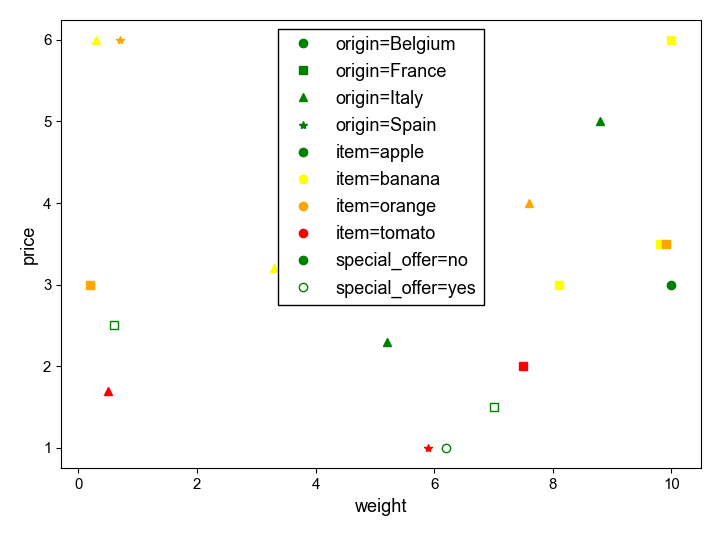

# scatter_df
Make a scatterplot easily from a dataframe with different colors, markers, fillcolors from the values in the column of the dataframe. 

```python
import pandas 
import matplotlib.pyplot as plt
fruits = pandas.read_csv("fruits.csv", sep = ";")

print(fruits)
```
|    |   item | price | weight  | origin | sold_by | special_offer |
| ---| ------ | ----- | ------- | ------ | ------- | ------------- |   
| 0  |  apple |   1.5 |    7.0  | France |    unit |           yes |
| 1  | orange |   4.0 |    7.6  |  Italy |      kg |            no |
| 2  | banana |   3.0 |    8.1  | France |      kg |            no |
| 3  |  apple |   2.3 |    5.2  |  Italy |      kg |            no |
| 4  | orange |   6.0 |    0.7  |  Spain |    unit |            no |
| ...| ...    | ...   | ...     | ...    | ...     | ...           | 

```python
from scatter_df import scatter_df
fig, ax = plt.subplots()
scatter_df(ax, fruits, "weight", "price", color_by = "item", marker_by = "origin", 
           facecolor_by = "special_offer", listcolors = ["green","yellow","orange","red"])

plt.show()
``` 

